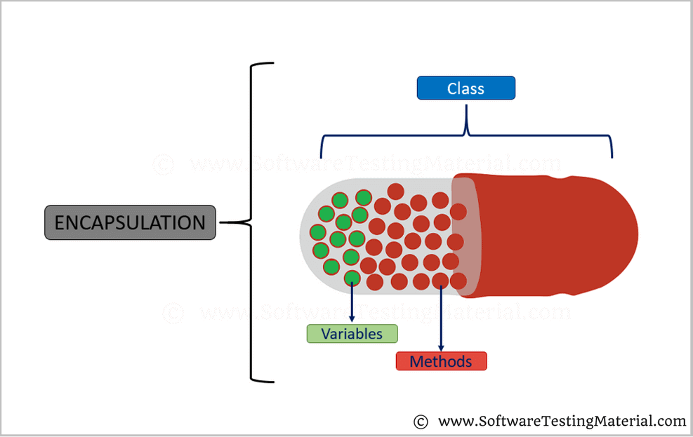

# Encapsulation

Encapsulation is extremely important method of OOP. This word refer to below photo.Firstly go this photo through please.



As you see; in this picture, we have some variable parameters which is important for us.In addition to that, we don't want to them would be changeable.That's why we use this method and we will protect this from the others also with encapsulation prodives us to reach this private field.Let's see an example. 

```text
 private DateTime _createDate = DateTime.Now;
        public DateTime CreateDate
        {
          get { return _createDate; }
          set { _createDate = value; }
        }
```

In first row we ve changed "CreateDate" field as a private\(access modifiers\)" and this member of class is encapsulated.After this code CreateDate can not be changed by other although we can reach property of member.

