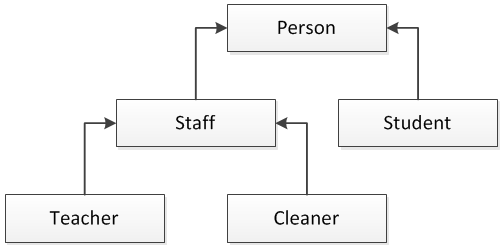

# Inheritance

Logic of  inheritance is same in the biology in terms of usage logic.Firstly,we created a BaseClass.This class can be called "Parent Class" for the other classes.In this phase u can not create an object because of OOP SOLiD rules.




For instance, in this picture "Person"  is the Base Class for "Student" and "Staff".On the other hand , "Staff" class is the Parent Class for "Teacher" and "Cleaner".By using this body, u can give any properties to subclass like "Teacher" and "Cleaner".Let's look code behind;

```text
public class BasePhone;
 public string Brand { get; set; }//Use prop + Tab + Tab
 public string Unitprice { get; set; }
 
```

  
Now we created a class which name is BasePhone.And now we will use inheritance for the SubClasses.

```text
 public class iphone: BasePhone
```

We created a class which name is iphone and gives all properties and methods from BaseClass which name is "BasePhone" by using ":" and consequently we will create an object of this classes and we will see properties of "iPhone Class".

```text
iphone iphone = new iphone();//Creating an object
iphone.Brand = "iphone ";//Calling from Baseparent
iphone.Model = "12 Pro Max";
iphone.Unitprice = "20.000";
MessageBox.Show($"id:{iphone.Id}\nBrand:{iphone.Brand}\nModel:{iphone.Model}\nUnitprice:{iphone.Unitprice}\nSeni:{iphone.Cal()}");
```

## Virtual Usage in the Inheritance;

Override is a process that uses for changing a method on the Subclass \(inherited from BaseClass\).By using virtual,we will create a rule for subclass in terms of method knowledge,moreover,u can not skip subclass row without obey the rules that we created before.Therefore in the subclasses,all of them,should have different ability.

```text
  public virtual string Cal()
    {
           return "Call ring tone of iPhone"; 
    }
```


